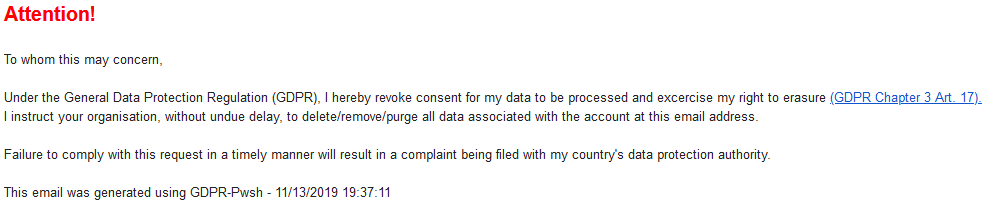

# GDPR-Pwsh
A PowerShell app/function to send GDPR emails; powered by AnyBox. 

# Installation

```powershell
Import-Module -Name "{Full Path}\GDPR-Pwsh\GDPR-Pwsh" -Verbose
```

## Email Image



## Example Usage

* **NOTE**: By default, the function uses **smtp.gmail.com** as it's default SMTP server.

* See [GDPR-Pwsh.psm1](GDPR-Pwsh\GDPR-Pwsh.psm1) for all parameters and examples.

### Function (Send-GdprEmail)

```powershell
$EmailPassword = "<Password Here>" | ConvertTo-SecureString -AsPlainText -Force
Send-GdprEmail -SmtpServer "smtp.office365.com" -EmailPassword $EmailPassword -Recipient "foo@email.com","bar@email.com" -From "foobar@outlook.com" -$Cc "foo@email.com","bar@email.com" -$Bcc "bar@email.com" -Verbose
```

### App

```powershell
Show-GdprPwsh
```

## Authors -- Contributors

* **Dextroz** - *Author* - [Dextroz](https://github.com/Dextroz)

## License
This project is licensed under the MIT License - see the [LICENSE](LICENSE) for details.